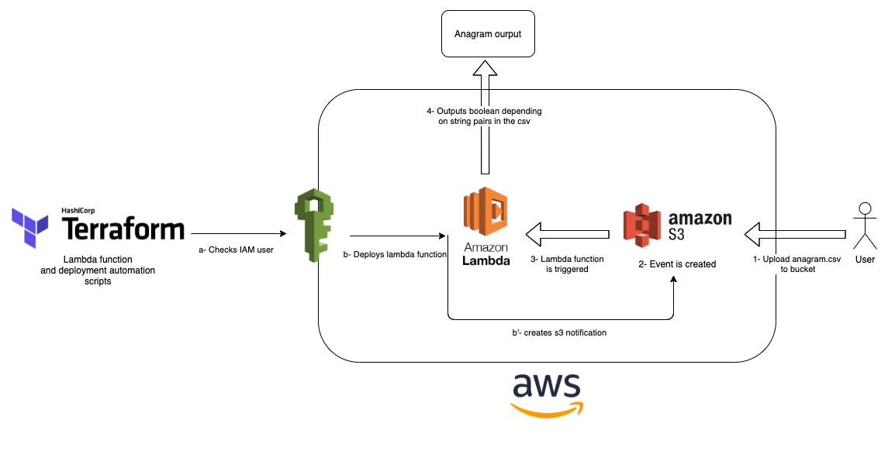

# Terraform - AWS Lambda Project
The main goal of this project is to deploy a function on AWS Lambda using Terraform, which should be activated everytime a specific file is uploaded to the S3 Bucket.

### 1.Dataset Description
The anagram.csv file contains two columns (available in anagram_sample.csv), where each of them represents a string. These strings are to be compared row-wise to see if they constitute an anagram.

### 2. Project Architecture
This project was developed using Terraform as IaC (Infrastructure as Code) to deploy the anagram function in AWS Lambda. For that, the first step was to provide the region and the user acces key in order to access AWS (provider.tf). After that, an IAM policy was set to integrate the S3 service into Terraform (iam.tf). Finally, the lambda function was compressed and the s3 bucket notification was created to triggerr the function once an anagram.csv file is uploaded (lambda.tf).
The chart down below describes the whole process of this project:


### 3. Project commands:
1. Initializing Terraform:
```console
macos@iyadh:~$ terraform init
```

2. Creating the execution plan:
```console
macos@iyadh:~$ terraform plan
```

Updating an existing plan:
```console
macos@iyadh:~$ terraform apply
```

Destroy the Terraform Infrastructure:
```console
macos@iyadh:~$ terraform apply
```

### 4. Constraints
This project was not tested on an AWS production environment due to lack of resources, although different code parts were reimplemented based on Terraform's official documentation.

